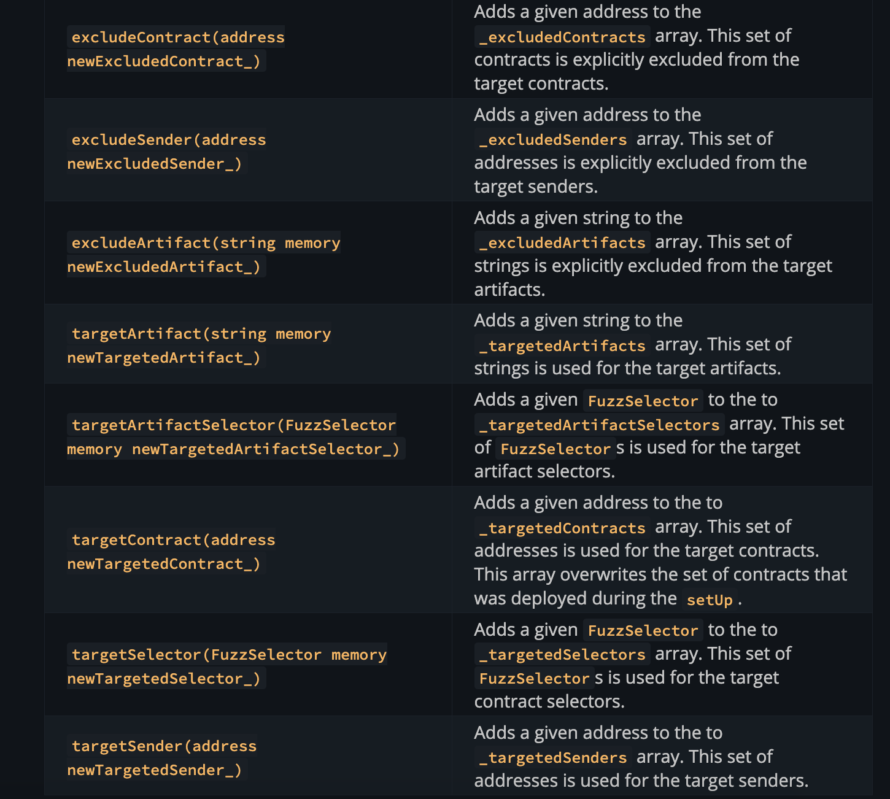

# Invariant testing

### Intro

- invariant expressions are checked after end of each function call
- invariant expressions MUST be true in all conditions, for all states, and for randomized call sequences of pre-defined functions in pre-defined formats
- can expose false assumptions or incorrect logic in highly complex and convoluted states/ edge cases
- Invariant tests have 2 components

  - `runs` -> number of times sequence of functions is called
  - `depth` -> number of function calls made in a given run

- invariant functions start with prefix `invariant_`

--

### Types of invariant definitions

| Invariant type            | Explanation                                                                       | Example                                                      |
| ------------------------- | --------------------------------------------------------------------------------- | ------------------------------------------------------------ |
| Direct assertion          | Assert values as expected by querying a function                                  | `assertEq(nftBalance, nft.totalSupply())`                    |
| Ghost variable assertions | query protocol and compare with a value persisted in test environment             | `assertLe(getLoansCount(), loanCounter)`                     |
| Deoptimizing              | query a protocol and compare it with gas inefficient implementation of same logic | `assertEq(pool.outstandingInterest(), test.naiveInterest())` |

---

### conditional invariants

Invariants might not be applicable under all circumstances - incases where invariants are conditional, make sure that you don't leave incomplete logic paths - every path should have a specific assertion.

for eg., some invariant on collateral might only be applicable in a liquidation scenario - if such case, make liquidation scenario `true` and for all other conditions, exit the path by asserting a valid condition

Below code should be avoided as it leads to false positives when `protocolCondition` is true. The invariant is not asserted at all when condition is true.

```
function invariant_example() external {
    if (protocolCondition) return;

    assertEq(val1, val2);
}
```

A better approach would be to assert when `protocolCondition` is false and then return, as follows

```
function invariant_example() external {
    if (protocolCondition) {
        assertLe(val1, val2);
        return;
    };

    assertEq(val1, val2);
}
```

Another way is to use dedicated invariants for different scenarios. scenarios are bootstrapped using `setUp` function in such as way that only specific scenarios materialize.

That takes us to next section...

### Invariant Targets

**Target Contracts** - Set of contracts that will be called over course of a given invariant fuzzing campaign. It defaults to all contracts deployed in `setUp` but can be customized further

**Target Senders** - invariant test fuzzer picks random values for `msg.sender` - set of senders can be customized in the `setUp` function

**Target Selectors** - set of function selectors that can be used by fuzzer for invariant testing -> they could be a subset of functions in target contracts

**Target Artifacts** - desired ABI to be used for given contract -> these can be used for proxy contract configurations - check example????

**Target Artifcat Selectors** - desired subset of function selectors to vbe used within abi to be used for given contract -> used for proxy contract config

Priorities in case of clashes

`target selectors >  excludeContracts > Target Contracts`

## Function call proibability distribution

- probabilities are first distributed between contracts
- next, within each contract, they are again split among functions

```
targetContract1: 50%
├─ function1: 50% (25%)
└─ function2: 50% (25%)

targetContract2: 50%
├─ function1: 25% (12.5%)
├─ function2: 25% (12.5%)
├─ function3: 25% (12.5%)
└─ function4: 25% (12.5%)

```

Note in above, target contract with lesser functions have more function calls to a given function than contract with more functions.

Here are a bunch of helper functions, copying table from forge documentation for future reference



### Target contract setup

Setup using any of 3 methods

- manually add to `targetContracts` array
- contracts deployed in `setUp` function -> only works if no contracts added manually as per previous step
- contracts deployed in `setUp` can be removed by adding them to `excludeContracts` array

### Handler based Testing

- In open testing, sometimes functions don't have the right state to execute -> in such cases, every fuzzing call will revert (and hence return true when `fail_on_revert` is set to false). For eg, if a contract has a deposit function that is supposed to be accessed by a user, each fuzzing call to this function will fail because there might not be enough token balance or the contracts do not have correct approvals. In such cases, a router that can setup correct parameters for testing is needed. This is calledthe `handler` contract

- In [InvariantBasicERC4626DepositHandler.t.sol](../test/invariants/InvariantBasicERC4626DepositHandler.t.sol), we have defined a handler that defines a `deposit` function -> this function adds an additional logic of minting tokens, assigning approval of token to `BasicERC4626Deposit` contract and then calling the `deposit` function. By doing this intermediate step, the router is ensuring that all calls are valid calls with necessary approvals and token balances in place.

### Ghost variables

- ghost variables are needed to keep track of intermediate states in a handler
- For eg., in a deposits function, we need to track the total number of depositors or the maximum deposit per vault owner -> in this case, we need to keep track of these variables, typically inside a handler contract
- For convention, prefix ghost variables with `ghost_`. This will allow us to

### Finer points

- During invariant test, fuzzer generates random call sequences and calldata
- However, msg.value is not fuzzed by fuzzer
